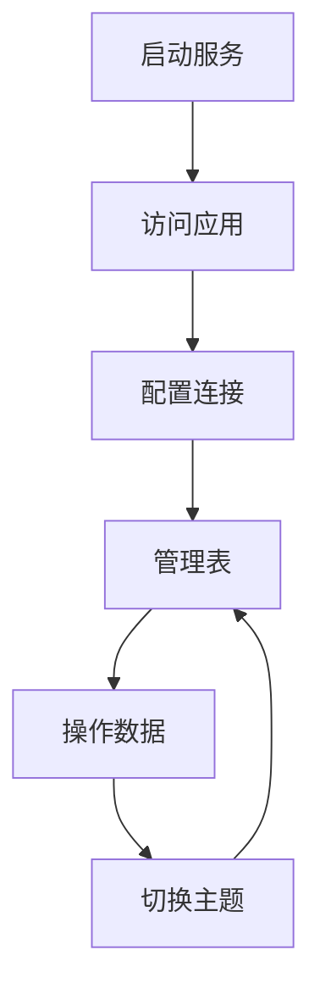

# DynamoDB 管理工具产品需求文档

## 1. 产品概览

DynamoDB 管理工具是一个基于 React 18 + TypeScript + Tailwind CSS 开发的可视化管理工具，用于管理本地 DynamoDB 实例。

- 解决本地 DynamoDB 实例缺乏可视化管理界面的问题，提供直观的表管理和数据操作功能。
- 帮助开发人员更高效地进行 DynamoDB 相关开发和测试，提升开发效率。

## 2. 核心功能

### 2.1 功能模块

我们的 DynamoDB 管理工具包含以下主要页面：

1. **首页**：显示应用状态和快速操作指南
2. **表管理**：管理 DynamoDB 表的创建、列出和删除
3. **数据操作**：对表中的数据进行增删改查操作
4. **设置**：配置 DynamoDB 连接信息和应用主题

### 2.2 页面详情

| 页面名称 | 模块名称 | 功能描述 |
|-----------|-------------|---------------------|
| 首页 | 状态卡片 | 显示 DynamoDB 连接状态和表统计信息 |
| 首页 | 功能介绍 | 介绍应用的主要功能模块 |
| 首页 | 快速操作 | 提供启动本地 DynamoDB 和开发服务器的命令指南 |
| 表管理 | 表列表 | 显示所有 DynamoDB 表的列表 |
| 表管理 | 创建表 | 提供表单创建新的 DynamoDB 表 |
| 表管理 | 删除表 | 允许删除现有的 DynamoDB 表 |
| 数据操作 | 表选择 | 选择要操作的 DynamoDB 表 |
| 数据操作 | 操作类型选择 | 选择要执行的数据操作类型（创建、读取、更新、删除、查询） |
| 数据操作 | 表单输入 | 根据操作类型显示相应的表单输入界面 |
| 数据操作 | 数据列表 | 显示表中的数据列表 |
| 设置 | 连接配置 | 配置 DynamoDB 连接信息（端点、区域、访问密钥、密钥） |
| 设置 | 主题设置 | 切换应用的浅色和深色主题 |
| 设置 | 配置管理 | 保存和重置配置 |

## 3. Core Process

用户使用 DynamoDB 管理工具的主要流程如下：

1. **启动服务**：用户启动本地 DynamoDB 服务和应用开发服务器
2. **访问应用**：用户通过浏览器访问应用界面
3. **配置连接**：用户在设置页面配置 DynamoDB 连接信息
4. **管理表**：用户在表管理页面创建、列出和删除表
5. **操作数据**：用户在数据操作页面对表中的数据进行增删改查操作
6. **切换主题**：用户根据环境切换应用主题

## 4. 用户接口设计

### 4.1 设计风格

- **主色和辅色**：使用蓝色系作为主色调（#3b82f6 到 #1d4ed8），灰色系作为辅助色
- **按钮样式**：使用圆角按钮，主操作按钮使用渐变背景
- **字体**：使用无衬线字体（Inter, system-ui, Avenir, Helvetica, Arial, sans-serif）
- **布局样式**：采用卡片式布局，清晰的视觉层次
- **图标样式**：使用 Lucide React 图标库，风格统一

### 4.2 页面设计概览

| 页面名称 | 模块名称 | UI元素 |
|-----------|-------------|-------------|
| 首页 | 状态卡片 | 网格布局的卡片，显示连接状态和表统计，使用图标增强视觉效果 |
| 首页 | 功能介绍 | 网格布局的功能卡片，每个卡片包含图标、标题和描述 |
| 首页 | 快速操作 | 代码块显示命令，使用浅色背景增强可读性 |
| 表管理 | 表列表 | 响应式表格，显示表名和操作按钮 |
| 表管理 | 创建表 | 模态框表单，包含表名、键架构、属性定义和吞吐量配置 |
| 数据操作 | 操作表单 | 动态表单，根据操作类型显示不同的输入字段 |
| 数据操作 | 数据列表 | 响应式表格，显示表中的数据，支持分页 |
| 设置 | 连接配置 | 表单输入字段，包含端点、区域、访问密钥和密钥 |
| 设置 | 主题设置 | 卡片式按钮，显示浅色和深色主题选项 |

### 4.3 自适应

- **设计理念**：采用移动优先的响应式设计理念
- **断点设置**：使用 Tailwind CSS 的默认断点（sm, md, lg, xl）
- **布局调整**：在不同屏幕尺寸下自动调整布局，确保在移动设备上也能正常使用
- **交互优化**：在移动设备上优化触摸交互，增大点击区域

应用主要面向桌面端开发人员使用，但也支持在平板和手机等移动设备上进行基本操作。