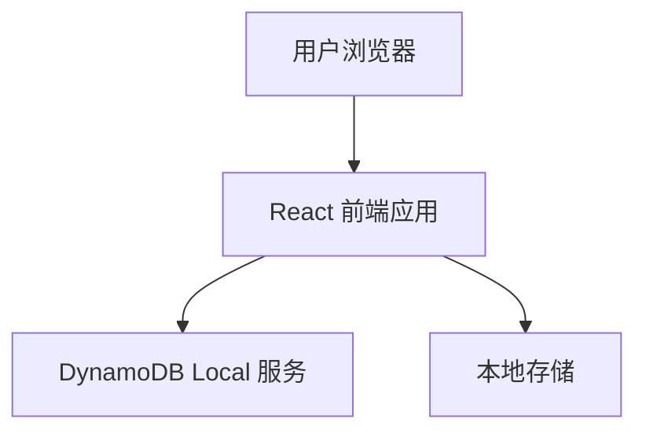
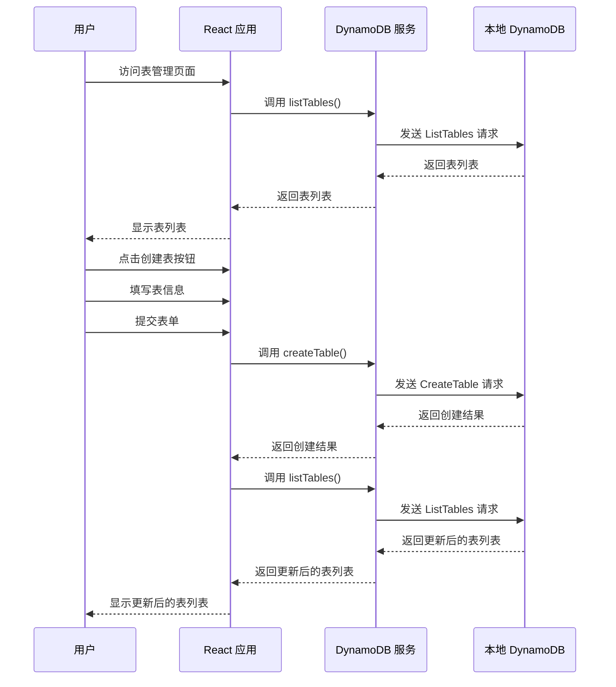
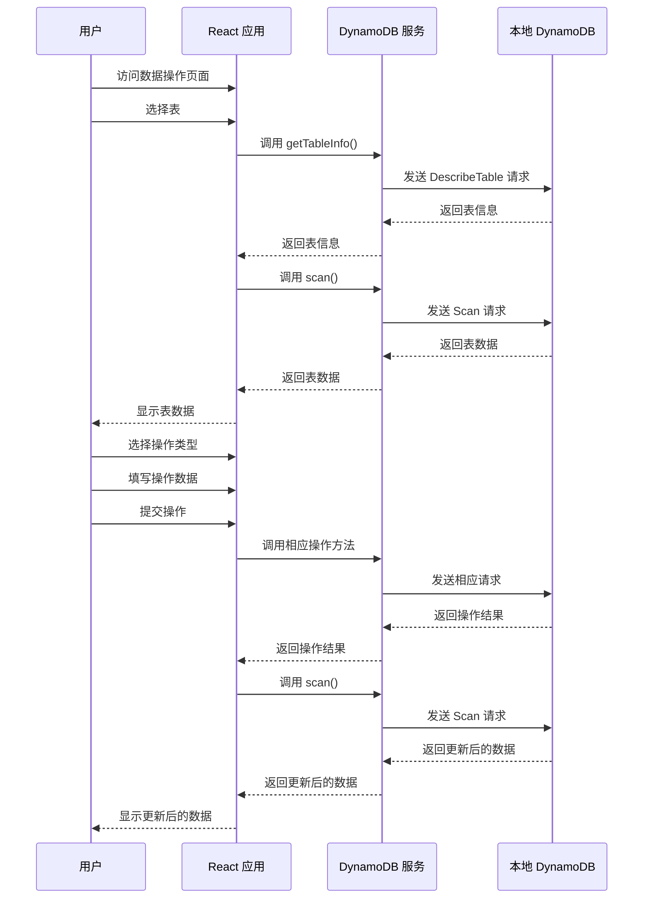

# DynamoDB 管理工具技术架构文档

## 1. 技术选型

### 1.1 前端技术栈

| 技术 | 版本 | 用途 |
|---------|---------|---------|
| React | 18.2.0 | 前端框架，用于构建用户界面 |
| TypeScript | 5.2.2 | 类型安全的 JavaScript 超集 |
| Tailwind CSS | 3.4.19 | 实用优先的 CSS 框架，用于快速构建现代 UI |
| Vite | 5.2.0 | 现代前端构建工具，提供快速的开发体验 |
| AWS SDK v3 | 3.585.0 | 用于与 DynamoDB 服务进行交互 |
| Lucide React | 0.395.0 | React 图标库，提供丰富的图标资源 |

### 1.2 后端技术栈

| 技术 | 版本 | 用途 |
|---------|---------|---------|
| DynamoDB Local | 3.3.0 | 本地测试版本的 AWS DynamoDB |
| Docker | - | 容器化环境，用于运行 DynamoDB Local |
| Docker Compose | 3.8 | 用于定义和运行多容器 Docker 应用 |

### 1.3 开发工具

| 工具 | 用途 |
|---------|---------|
| ESLint | 代码质量检查工具 |
| Prettier | 代码格式化工具 |
| Git | 版本控制工具 |
| GitHub | 代码托管平台 |

## 2. 架构设计

### 2.1 系统架构

我们的 DynamoDB 管理工具采用前端单页应用架构，与本地 DynamoDB 实例直接交互。



- **用户浏览器**：用户通过浏览器访问应用界面
- **React 前端应用**：提供用户界面和业务逻辑
- **DynamoDB Local 服务**：本地运行的 DynamoDB 实例，处理数据存储和检索
- **本地存储**：用于持久化应用配置

### 2.2 核心流程图

#### 表管理流程



#### 数据操作流程



## 3. 目录结构

```
solo_DynamoDB/
├── web/                # React 前端应用
│   ├── src/            # 源代码
│   │   ├── context/    # 状态管理
│   │   ├── pages/      # 页面组件
│   │   ├── services/   # 服务封装
│   │   ├── types/      # 类型定义
│   │   ├── utils/      # 工具函数
│   │   ├── App.tsx     # 应用主组件
│   │   └── main.tsx    # 应用入口
│   ├── dist/           # 构建输出
│   ├── package.json    # 项目配置
│   └── vite.config.ts  # Vite 配置
├── data/               # DynamoDB 数据目录
├── doc/                # 文档
│   ├── PRD.md          # 产品需求文档
│   └── TechnicalArchitecture.md # 技术架构文档
├── docker-compose.yml  # Docker 配置
└── README.md           # 项目说明
```

### 3.1 核心文件说明

| 文件路径 | 职责 |
|---------|---------|
| `web/src/context/appContext.tsx` | 应用状态管理，使用 React Context API + useReducer |
| `web/src/services/dynamodbService.ts` | DynamoDB 服务封装，提供与 DynamoDB 交互的方法 |
| `web/src/utils/configManager.ts` | 配置管理工具，用于加载和保存配置 |
| `web/src/pages/TableManagementPage.tsx` | 表管理页面，实现表的创建、列出和删除 |
| `web/src/pages/DataOperationPage.tsx` | 数据操作页面，实现数据的增删改查 |
| `web/src/pages/SettingsPage.tsx` | 设置页面，实现连接配置和主题切换 |
| `docker-compose.yml` | Docker 配置，用于启动本地 DynamoDB 实例 |

## 4. 核心功能模块

### 4.1 状态管理模块

状态管理模块使用 React Context API + useReducer 实现，提供全局状态管理和操作方法。

**核心功能**：
- 管理应用配置
- 管理 DynamoDB 服务实例
- 管理表列表和当前选中的表
- 管理表数据
- 管理加载状态和错误信息

**关键代码**：
- `web/src/context/appContext.tsx`：实现状态管理逻辑
- `web/src/context/types.ts`：定义状态管理相关类型

### 4.2 DynamoDB 服务模块

DynamoDB 服务模块封装了 AWS SDK v3 的 DynamoDB 客户端，提供与 DynamoDB 交互的方法。

**核心功能**：
- 表管理：创建表、列出表、删除表、获取表信息
- 数据操作：创建数据、读取数据、更新数据、删除数据、查询数据、扫描数据

**关键代码**：
- `web/src/services/dynamodbService.ts`：实现 DynamoDB 服务封装

### 4.3 配置管理模块

配置管理模块用于加载和保存应用配置，支持本地存储持久化。

**核心功能**：
- 加载配置：从本地存储或默认配置加载
- 保存配置：将配置保存到本地存储
- 获取默认配置：返回默认配置

**关键代码**：
- `web/src/utils/configManager.ts`：实现配置管理逻辑

### 4.4 页面组件模块

页面组件模块包含应用的各个页面，实现用户界面和交互逻辑。

**核心页面**：
- 首页：显示应用状态和快速操作指南
- 表管理：管理 DynamoDB 表
- 数据操作：操作表中的数据
- 设置：配置应用和连接信息

**关键代码**：
- `web/src/pages/HomePage.tsx`：首页组件
- `web/src/pages/TableManagementPage.tsx`：表管理页面组件
- `web/src/pages/DataOperationPage.tsx`：数据操作页面组件
- `web/src/pages/SettingsPage.tsx`：设置页面组件

## 5. 技术实现细节

### 5.1 DynamoDB 连接配置

DynamoDB 连接配置使用本地存储持久化，默认配置指向本地 DynamoDB 实例。

**关键代码**：
```typescript
// 默认配置
const DEFAULT_CONFIG: AppConfig = {
  dynamodb: {
    endpoint: 'http://localhost:8000',
    region: 'us-east-1',
    accessKeyId: 'dummy',
    secretAccessKey: 'dummy'
  },
  theme: 'light'
};
```

### 5.2 CORS 配置

DynamoDB Local 服务配置了 CORS 支持，允许浏览器请求。

**关键代码**：
```yaml
command:
  -jar DynamoDBLocal.jar
  -sharedDb
  -dbPath /home/dynamodblocal/data
  -cors "*"
```

### 5.3 主题切换实现

主题切换使用 Tailwind CSS 的 dark 模式，通过修改 HTML 元素的 class 实现。

**关键代码**：
```typescript
// 根据主题配置更新 html 元素的 dark 类
useEffect(() => {
  if (state.config.theme === 'dark') {
    document.documentElement.classList.add('dark');
  } else {
    document.documentElement.classList.remove('dark');
  }
}, [state.config.theme]);
```

### 5.4 错误处理

应用实现了统一的错误处理机制，显示操作结果和错误信息。

**关键代码**：
```typescript
// 错误处理
try {
  const tables = await state.dynamoDBService.listTables();
  dispatch({ type: 'SET_TABLES', payload: tables });
} catch (error) {
  console.error('Failed to list tables:', error);
  dispatch({ type: 'SET_ERROR', payload: 'Failed to list tables' });
}
```

## 6. 部署与开发

### 6.1 本地开发环境

**步骤**：
1. 克隆代码仓库
2. 启动本地 DynamoDB 实例：`docker-compose up -d`
3. 安装依赖：`cd web && npm install`
4. 启动开发服务器：`npm run dev`
5. 访问应用：http://localhost:3000

### 6.2 构建与部署

**构建步骤**：
1. 安装依赖：`cd web && npm install`
2. 构建应用：`npm run build`
3. 构建输出：`web/dist` 目录

**部署方式**：
- 静态文件服务器：将 `web/dist` 目录部署到任何静态文件服务器
- 容器化部署：使用 Docker 构建和运行

## 7. 监控与维护

### 7.1 日志管理

应用使用控制台日志记录操作和错误信息，便于调试和问题排查。

**关键代码**：
```typescript
console.error('Failed to initialize DynamoDB service:', error);
dispatch({ type: 'SET_ERROR', payload: 'Failed to initialize DynamoDB service' });
```

### 7.2 常见问题与解决方案

| 问题 | 原因 | 解决方案 |
|---------|---------|---------|
| 连接失败 | DynamoDB 服务未启动 | 启动 DynamoDB 服务：`docker-compose up -d` |
| CORS 错误 | DynamoDB 服务未配置 CORS | 确保 docker-compose.yml 中配置了 `-cors "*"` |
| 表创建失败 | 表名不符合规范或键架构不正确 | 检查表名和键架构配置 |
| 数据操作失败 | 键值不正确或权限不足 | 检查键值配置和权限 |

## 8. 技术挑战与解决方案

### 8.1 技术挑战

1. **CORS 配置**：浏览器请求 DynamoDB 服务时的跨域问题
2. **状态管理**：复杂应用状态的管理和同步
3. **错误处理**：统一的错误处理和用户反馈
4. **响应式设计**：适配不同屏幕尺寸
5. **配置管理**：配置的持久化和加载

### 8.2 解决方案

1. **CORS 配置**：在 docker-compose.yml 中添加 `-cors "*"` 参数
2. **状态管理**：使用 React Context API + useReducer 实现全局状态管理
3. **错误处理**：实现统一的错误处理机制，显示操作结果和错误信息
4. **响应式设计**：使用 Tailwind CSS 的响应式类实现适配
5. **配置管理**：使用本地存储持久化配置，支持默认配置和环境变量

## 9. 未来扩展

### 9.1 潜在的功能扩展

1. **批量操作**：支持批量创建、更新和删除数据
2. **数据导入导出**：支持 CSV、JSON 等格式的数据导入导出
3. **索引管理**：支持二级索引的创建和管理
4. **查询构建器**：可视化的查询条件构建器
5. **多环境支持**：支持连接到不同环境的 DynamoDB 实例
6. **数据可视化**：提供数据统计和可视化图表

### 9.2 技术架构优化

1. **性能优化**：使用 React.memo、useMemo、useCallback 等优化渲染性能
2. **代码分割**：使用动态导入实现代码分割，减小初始加载体积
3. **测试覆盖**：增加单元测试和集成测试
4. **CI/CD**：配置持续集成和持续部署流程
5. **国际化**：支持多语言

## 10. 总结

DynamoDB 管理工具采用现代前端技术栈，提供了直观、高效的本地 DynamoDB 管理界面。通过合理的架构设计和技术选型，解决了本地 DynamoDB 实例缺乏可视化管理界面的问题，为开发人员提供了便捷的开发和测试工具。

项目的核心价值在于：
- 提供直观的可视化管理界面
- 简化 DynamoDB 相关开发和测试流程
- 提升开发效率和体验
- 作为学习 React 18 + TypeScript + Tailwind CSS 的示例项目

通过本技术架构文档，我们详细说明了项目的技术选型、架构设计、核心功能模块和技术实现细节，为项目的后续开发和维护提供了参考。